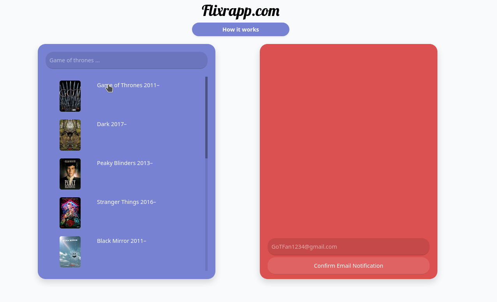

import { Image } from 'astro:assets';
import HowItWorks1 from '../../img/flixr/howitworks1.mp4';
import Final from '../../img/flixr/final.mp4';

## Flixr

Flixr is a sleek and intuitive platform designed for getting reminders about your favourite TV shows. Finding out a year too late that your favourite show had a new season air can be a frustrating experience, so I created flixr. You enter the shows you're interested in, and flixr will send you a notification when a new season is released.

<video src={Final} alt="Final" loading="lazy" controls />
 

### Features
- **One link authorization** - A custom password-less authentication solution for frictionless onboarding.
- **Wallpaper Pack** - Download high-quality wallpapers for your favorite shows.
- **Simplicity** - Flixr is designed to be easy to use, keeping out of your way.
- **Responsive UI** - Optimized for all devices.

### Technologies Used
- **Frontend:** Laravel, Blade, Bootstrap
- **Backend:** Laravel, PHP
- **Database:** MySQL
- **API Integration:** TMDb API
- **Reminder Service**: Rust

### Repository
Check out the source code at the [GitLab Repository](https://gitlab.com/DarkZek/flixr).

### Concepts
First MVP of Flixr, showcasing the main features and user interface.

This is the first iteration on the 'How it works' guide, designed to help users understand the platforms use-case.
<video src={HowItWorks1} alt="How It Works" loading="lazy" controls />
 

### Future Improvements
- Calendar Integration: Sync reminders with your calendar.
- Live Chat: Add a live chat for everyone experiencing the show release
